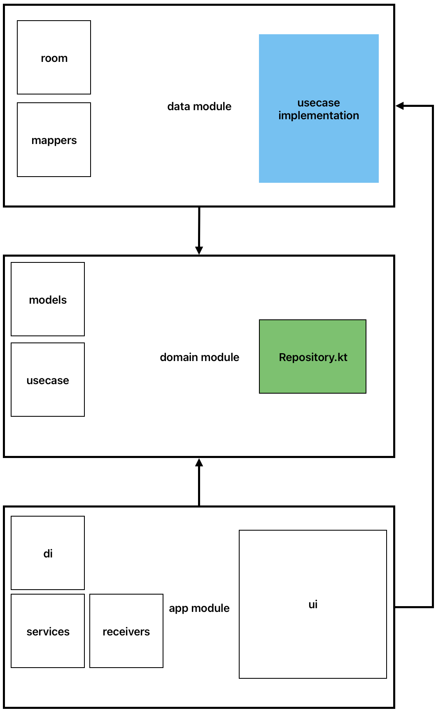
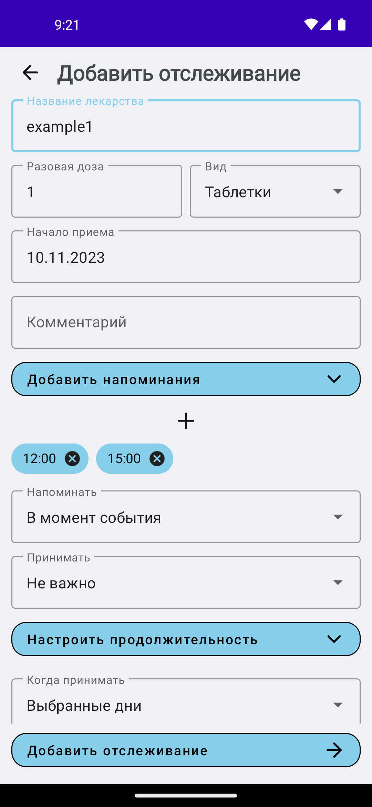
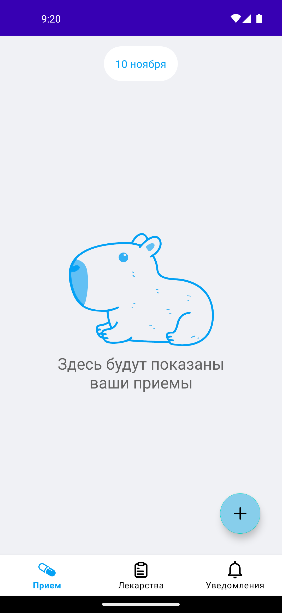
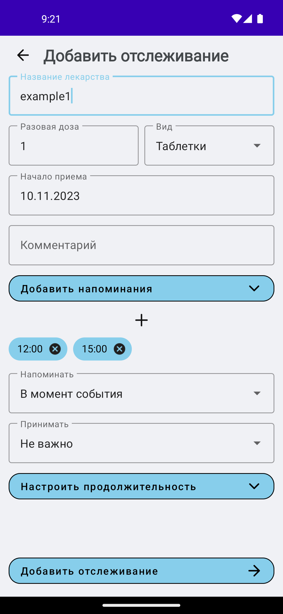
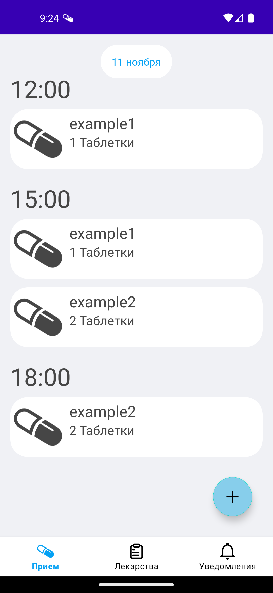
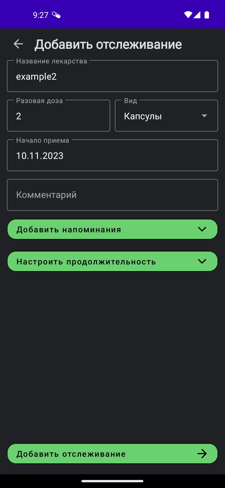
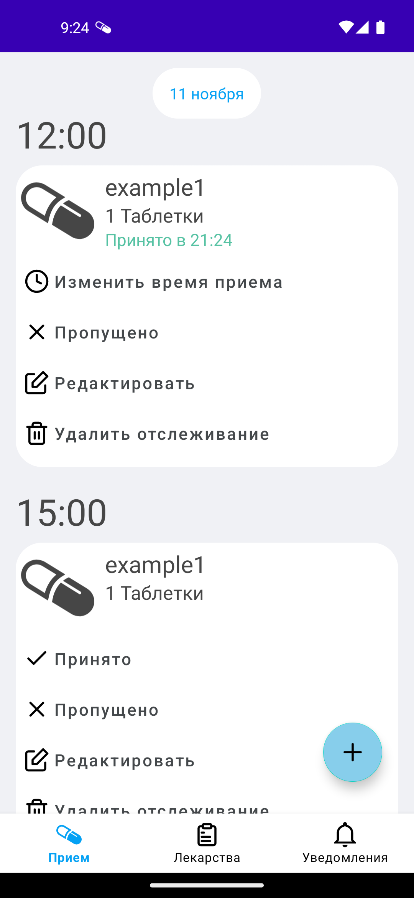
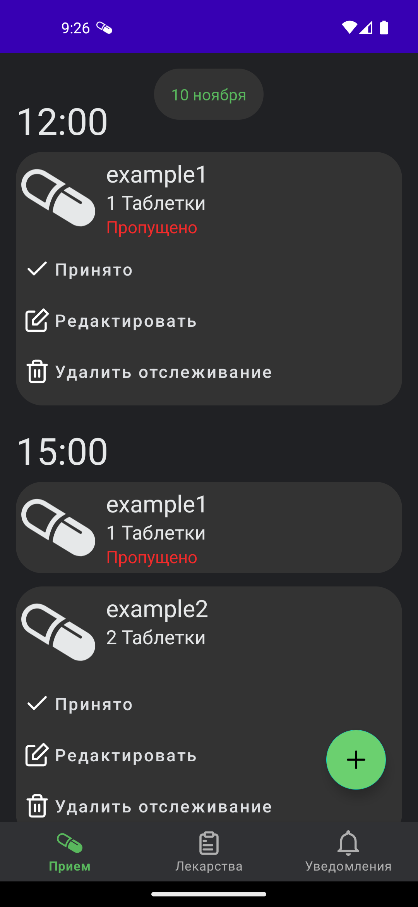

# MedsTime

## Описание

Цель приложения MedsTime - помочь пользователям контролировать количество полученных препаратов в аптеке и обеспечить им напоминания о принятии лекарств. Готовое приложение будет предоставлять возможность отслеживать запасы лекарств, напоминать о необходимости их приема, и предоставлять обзор истории потребления.

### Основной стек
- **Язык разработки:** Kotlin;
- **Архитектура:** Clean architecture с паттернами MVI и MVVM;
- **User interface:** XML (70%), Jetpack Compose (30%);
- **Dependency injection:** Koin;
- **Другой стек:** BroadcastReciever, Service, LiveData, Flow, Room, coroutines.

### Упрощенная визуализация общей архитектуры

## Скриншоты

  <figure>
    
  </figure>

  <figure>
    
  </figure>

  

<figure>
    
  </figure>

<figure>
  
</figure>

<figure>
  
</figure>

<figure>
  
</figure>

<figure>
  
</figure>

<figure>
  
</figure>

